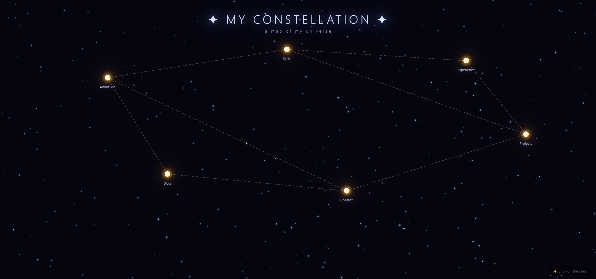

# 🌌 Constellation Portfolio - Interactive Night Sky Theme

> **Turn your portfolio into a magical, interactive constellation.**  
> A unique, open-source personal website where every star tells a story.

<p align="center">
  
</p>

<p align="center">
  <a href="https://www.youtube.com/watch?v=Bq83ZkTeeao">
    
  </a>
  <a href="https://github.com/you-mountain/constellation-portfolio/blob/main/index.html">
    
  </a>
  <a href="https://github.com/you-mountain/constellation-portfolio">
    
  </a>
</p>

<p align="center">
  
  
  
  
</p>

---

## 📖 Table of Contents

- [The Story Behind This Project](#-the-story-behind-this-project)
- [Live Demo & Tutorial](#-live-demo--tutorial)
- [Features](#-features)
- [How It Works](#-how-it-works)
- [Quick Start](#-quick-start)
- [Customization Guide](#-customization-guide)
- [Star Map & Sections](#-star-map--sections)
- [Tech Stack](#-tech-stack)
- [Project Structure](#-project-structure)
- [Color Scheme & Design](#-color-scheme--design)
- [Browser Support](#-browser-support)
- [Perfect For](#-perfect-for)
- [Contributing](#-contributing)
- [Connect With Me](#-connect-with-me)
- [License](#-license)
- [Support & Acknowledgments](#-support--acknowledgments)

---

## ✨ The Story Behind This Project

Tired of boring, generic portfolio templates that all look the same? Me too.

I built this **constellation portfolio** because I wanted something different. Something that would make recruiters stop scrolling and say "Wow, I've never seen this before."

Instead of a traditional list of skills and experiences, every star in this night sky represents a different chapter of my professional journey. The lines connecting them show how everything fits together. It's not just a portfolio—it's **my personal universe**.

The entire project is built with **pure HTML, CSS, and JavaScript**. No React. No frameworks. No bloat. Just clean, vanilla code that anyone can understand and customize.

**🎥 Want to see exactly how it was built?**  
I made a complete step-by-step tutorial walking through every line of code.

<p align="center">
  <a href="https://www.youtube.com/watch?v=Bq83ZkTeeao">
    
  </a>
</p>

---

## 🚀 Live Demo & Tutorial

| Resource | Link |
|:---|:---|
| **📺 Full Tutorial** | [Watch on YouTube](https://www.youtube.com/watch?v=Bq83ZkTeeao) |
| **🌐 Live Website** | [View Demo](https://you-mountain.github.io/constellation-portfolio) |
| **📂 Source Code** | [GitHub Repository](https://github.com/you-mountain/constellation-portfolio) |
| **🎥 YouTube Channel** | [Mountain](https://www.youtube.com/@mountain8474) |

---

## ✨ Features

| Feature | Description |
|:---|:---|
| 🌟 **Interactive Star Map** | Click on any star to reveal a different section |
| 🎨 **Glassmorphism Design** | Modern frosted glass UI with `backdrop-filter` |
| ✨ **Animated Night Sky** | Dynamic background with hundreds of twinkling stars |
| 🔗 **Connected Lines** | Stars form a unique constellation network |
| 💫 **Particle Effects** | Magical floating particles around modal cards |
| 📱 **Fully Responsive** | Looks stunning on mobile, tablet & desktop |
| ⚡ **Zero Dependencies** | Pure HTML, CSS, and vanilla JavaScript |
| 🌐 **Bilingual** | English & Persian (فارسی) versions |
| 🔓 **Open Source** | MIT licensed—free for everything |
| ♿ **Accessible** | Keyboard navigation & screen reader friendly |
| 🎯 **SEO Optimized** | Semantic HTML & proper meta tags |

---

## 🎮 How It Works
You see a beautiful night sky
↓

Stars represent portfolio sections
↓

Lines connect related stars
↓

Click a star → Glass card opens
↓

Explore skills, projects, contact...
↓

Close & click another star!

text

### The Magic Behind the Scenes

- **Canvas API** draws the animated galaxy background
- **CSS backdrop-filter** creates the frosted glass effect
- **JavaScript events** handle all the interactivity
- **Array of objects** stores all your portfolio data
- **Dynamic rendering** updates content instantly

---

## 🚀 Quick Start

### Method 1: Just Download & Open

```bash
# 1. Clone the repository
git clone https://github.com/you-mountain/constellation-portfolio.git

# 2. Navigate to the folder
cd constellation-portfolio

# 3. Open in your browser
# Just double-click index.html!
# Or use:
open index.html  # Mac
start index.html # Windows
Method 2: Use GitHub's Download
text
1. Click the green "Code" button ↑
2. Select "Download ZIP"
3. Extract the folder
4. Open index.html in your browser
5. Done! 🎉
Method 3: Deploy to GitHub Pages (Free Hosting)
bash
# 1. Fork this repository
# 2. Go to Settings > Pages
# 3. Under "Source", select "main" branch
# 4. Click "Save"
# 5. Your site is live at:
#    https://yourusername.github.io/constellation-portfolio
🔧 Customization Guide
1. Find the Stars Array
Open index.html and locate this section (around line 500):

javascript
// ==========================================
// 📌 EDIT YOUR INFORMATION HERE
// ==========================================
const stars = [
    // Your stars go here...
];
2. Edit a Star
Each star has these properties:

javascript
{
    id: 'about',                    // Unique ID
    label: 'About Me',              // Shows below the star
    x: 18, y: 28,                   // Position (0-100%)
    connect: ['skills', 'contact'], // Connect to other stars
    emoji: '🌌',                    // Emoji in the modal
    title: 'About Me',              // Modal title
    content: `
        // Your HTML content here
        <span class="emoji-display">🌌</span>
        <p>Hey! I'm <strong>Your Name</strong></p>
        <p>Your job title</p>
        <p>📍 Your location</p>
    `
}
3. Change Star Positions
text
x = 0   → far left
x = 50  → center
x = 100 → far right

y = 0   → top
y = 50  → middle
y = 100 → bottom
4. Create Your Constellation
javascript
// Example: Connect About to Skills and Contact
connect: ['skills', 'contact']

// Example: Star with no connections
connect: []

// Example: Connect to multiple stars
connect: ['about', 'skills', 'projects', 'contact']
5. Add Your Content
You can add anything inside the content field:

Skill Tags:

html
<div class="skill-tags">
    <span class="skill-tag">React</span>
    <span class="skill-tag">Node.js</span>
    <span class="skill-tag">Python</span>
</div>
Social Links:

html
<div class="social-links">
    <a href="mailto:you@email.com" class="social-btn">📧 Email</a>
    <a href="#" class="social-btn">🐦 Twitter</a>
    <a href="#" class="social-btn">💼 LinkedIn</a>
</div>
Timeline Items:

html
<div class="timeline-item">
    <div class="date">2024 - Present</div>
    <div class="role">Senior Developer</div>
    <div>Company Name</div>
</div>
6. Add or Remove Stars
To add a new star:

javascript
// Just add another object to the array
{
    id: 'hobbies',
    label: 'Hobbies',
    x: 40, y: 50,
    connect: ['about'],
    emoji: '🎮',
    title: 'My Hobbies',
    content: `
        <span class="emoji-display">🎮</span>
        <p>Gaming, Photography, Hiking</p>
    `
}
To remove a star:
Just delete its object from the array and remove its ID from other stars' connect arrays.

🎯 Star Map & Sections
Default Constellation Pattern
text
                    ⚡ Skills (48%, 18%)
                        |
    🌌 About (18%, 28%) ──── 💼 Experience (78%, 22%)
           |                        |
    📝 Blog (28%, 62%) ──── 📡 Contact (58%, 68%) ──── 🚀 Projects (88%, 48%)
Star Reference Table
Star ID	Default Label	Position (x, y)	Connected To	Emoji
about	About Me	18%, 28%	skills, contact	🌌
skills	Skills	48%, 18%	about, projects, experience	⚡
experience	Experience	78%, 22%	skills, projects	💼
projects	Projects	88%, 48%	skills, experience, contact	🚀
contact	Contact	58%, 68%	about, projects, blog	📡
blog	Blog	28%, 62%	contact, about	📝
🛠️ Tech Stack
Technology	Purpose
HTML5	Semantic structure & accessibility
CSS3	Glassmorphism, animations, responsive design
JavaScript (Vanilla)	Canvas API, DOM manipulation, events
Canvas API	Galaxy background & constellation lines
CSS Grid & Flexbox	Layout system
CSS Custom Properties	Theming & colors
No frameworks!	No React, Vue, Angular, or Bootstrap
Why No Frameworks?
⚡ Faster loading (no bundle to download)

🎓 Easier to understand for beginners

🔧 Simpler customization

🌐 Better SEO (search engines read HTML directly)

💪 Teaches fundamental web concepts

📦 Zero node_modules!

📂 Project Structure
text
constellation-portfolio/
│
├── index.html              # 🌐 English version (main file)
├── README.md               # 📖 This documentation
├── LICENSE                 # 📄 MIT License
├── preview.png             # 🖼️ Project preview image
│
└── (optional additions)
    ├── persian.html        # 🇮🇷 Persian version
    ├── screenshot.png      # 📸 Additional screenshots
    └── preview.gif         # 🎬 Animated demo
That's it! Just one HTML file. No build tools, no dependencies, no complexity.

🎨 Color Scheme & Design
Element	Color	CSS Value
Background	Deep Space	#050510
Star Core	Bright Gold	#ffcc00
Star Glow	Warm Orange	#ff9933
Lines	Faded Gold	rgba(255, 190, 140, 0.3)
Modal Background	Frosted Glass	rgba(15, 20, 45, 0.8)
Modal Border	Subtle Gold	rgba(255, 255, 255, 0.12)
Title Text	Soft Gold	#ffeacc
Body Text	Light Blue	#d0dcff
Accent Links	Warm Gold	#ffcc88
Tag Background	Faded Gold	rgba(255, 200, 150, 0.08)
Want to Change the Theme?
Look for these CSS variables in the <style> section:

Background gradient colors

Star shadow colors

Modal background opacity

Line stroke colors

📱 Browser Support
Browser	Support	Minimum Version
Google Chrome	✅ Full	90+
Mozilla Firefox	✅ Full	88+
Apple Safari	✅ Full	14+
Microsoft Edge	✅ Full	90+
Opera	✅ Full	76+
Samsung Internet	✅ Full	15+
iOS Safari	✅ Full	14+
Android Chrome	✅ Full	90+
Key CSS features used:

backdrop-filter (supported in all modern browsers)

CSS Grid & Flexbox

CSS Animations & Transitions

Canvas API

🎯 Perfect For
Persona	Use Case
🧑‍💻 Web Developers	Stand out from other candidates
🎨 Designers	Showcase creative portfolio uniquely
📝 Students	Impress internship recruiters
💼 Freelancers	Attract high-value clients
🚀 Job Seekers	Get noticed by tech companies
🎓 Bootcamp Grads	Demonstrate skills differently
🌐 Content Creators	Personal brand website
💻 Agencies	Team member profile page
🤝 Contributing
I welcome contributions from everyone! Here's how:

How to Contribute
bash
# 1. Fork the repository
# 2. Clone your fork
git clone https://github.com/YOUR_USERNAME/constellation-portfolio.git

# 3. Create a new branch
git checkout -b feature/my-amazing-feature

# 4. Make your changes
# 5. Commit them
git commit -m "Add my amazing feature"

# 6. Push to your fork
git push origin feature/my-amazing-feature

# 7. Open a Pull Request
Contribution Ideas
🎨 New color themes (sunset, ocean, aurora)

🌟 Additional star shapes (diamond, hexagon, custom SVGs)

🌠 Shooting star animations across the sky

🔊 Sound effects on star click

🌍 More translations (Spanish, French, Arabic, Chinese)

🖼️ Custom icon support (use images instead of emojis)

📱 PWA support (offline mode, install as app)

🎵 Background music toggle

🔄 Theme switcher (multiple constellation designs)

📄 PDF export of the entire portfolio

Bug Reports
Found a bug? Please open an issue with:

What you were doing

What you expected to happen

What actually happened

Your browser & OS

Screenshots (if applicable)

📞 Connect With Me
<p align="center"> <a href="https://www.youtube.com/@mountain8474">  </a> <a href="https://github.com/you-mountain">  </a> </p>
Platform	Link
🎥 YouTube	Mountain
📂 GitHub	you-mountain
📺 Full Tutorial	Watch Video
🌐 This Project	Constellation Portfolio
📄 License
This project is licensed under the MIT License — meaning you can:

✅ Use it for personal projects

✅ Use it for commercial projects

✅ Modify and customize it

✅ Distribute your version

✅ Use it privately

The only requirement is keeping the copyright notice. See the LICENSE file for full details.

⭐ Support & Acknowledgments
If This Project Helped You:
<p align="center"> <a href="https://github.com/you-mountain/constellation-portfolio">  </a> <a href="https://www.youtube.com/@mountain8474?sub_confirmation=1">  </a> <a href="https://www.youtube.com/watch?v=Bq83ZkTeeao">  </a> </p>
Ways to Support:
⭐ Star this repository on GitHub

🎥 Subscribe to my YouTube channel

📺 Watch the full tutorial

💬 Comment your constellation name on the video

🔄 Share this project with other developers

🐛 Report bugs or suggest features

🤝 Contribute code improvements

Special Thanks
✨ The open-source community for endless inspiration

🌌 Everyone who starred, forked, or shared this project

💻 All developers who create amazing things with vanilla JavaScript

📊 Repository Stats
<p align="center">    </p>
❓ Frequently Asked Questions
<details> <summary><b>Q: Is this really free?</b></summary> <p>YES! The project is MIT licensed. You can use it for personal, educational, or commercial projects without paying anything.</p> </details><details> <summary><b>Q: Do I need coding experience?</b></summary> <p>Basic HTML knowledge helps, but you can customize everything by just editing text. The tutorial video walks you through every step.</p> </details><details> <summary><b>Q: Can I use this on my portfolio?</b></summary> <p>Absolutely! That's exactly what it's made for. Just customize the content and make it yours.</p> </details><details> <summary><b>Q: Will it work on mobile?</b></summary> <p>Yes! The design is fully responsive. It adapts beautifully to phones, tablets, and desktops.</p> </details><details> <summary><b>Q: How do I change the colors?</b></summary> <p>Edit the CSS in the &lt;style&gt; section. Look for color values and gradients—they're all clearly marked.</p> </details><details> <summary><b>Q: Can I add more than 6 stars?</b></summary> <p>Yes! Just add more objects to the stars array. You can have as many as you want.</p> </details><details> <summary><b>Q: How do I deploy this for free?</b></summary> <p>Use GitHub Pages! Push to a GitHub repository, enable Pages in Settings, and your site goes live instantly.</p> </details>
<p align="center"> <br> <b>Made with ✨ and 🌌 by <a href="https://www.youtube.com/@mountain8474">Mountain</a></b> <br> <i>May your stars always shine bright!</i> <br><br> <a href="https://www.youtube.com/watch?v=Bq83ZkTeeao">  </a> <br><br> <sub>⭐ If you like this project, please consider giving it a star!</sub> </p> 
